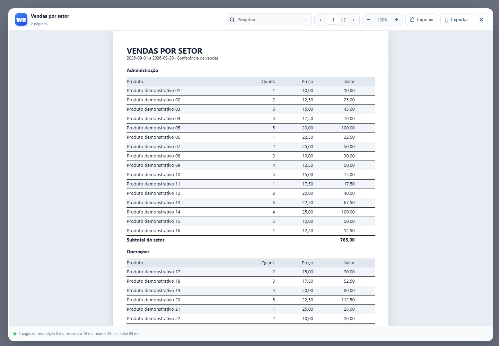

# WebReport

Visualizador de relatórios em JavaScript criado por **Evandro / GWBM**. Recebe estrutura e dados em JSON, monta páginas no navegador e oferece pesquisa, zoom, impressão e exportação CSV.



Esta distribuição contém o **front-end de execução dos relatórios**. O construtor visual, o gerador PHP, consultas SQL, CKEditor, TinyMCE e o framework GWBM não são necessários para os exemplos e não fazem parte deste pacote.

## Experimente

Abra `index.html` no navegador e escolha um dos exemplos. Como os dados são definidos em JavaScript local, não é preciso instalar dependências nem configurar servidor para esses exemplos.

Para desenvolver via HTTP, com Node.js 20 ou superior:

```sh
npm start
```

Acesse `http://127.0.0.1:8080`.

- [Vendas por setor](examples/01-vendas.html): solicita período, texto e seleção de setores; filtra 48 registros fictícios e demonstra grupos, cabeçalho de colunas, linhas alternadas, fórmula, subtotais, total e média.
- [Documentos encadeados](examples/02-documentos.html): solicita data, texto, organização e responsável; demonstra HTML, texto longo, quebra após cada registro, relatórios em retrato e paisagem na mesma sessão.

Os dados são fictícios. Os helpers em [report-data.js](examples/report-data.js) apenas simplificam a escrita do JSON demonstrativo.

## Interações e parâmetros

O ecossistema PHP do WebReport reconhece os marcadores abaixo no SQL/modelo e pode devolver formulários para coletar valores ausentes. Este pacote publica o visualizador: não inclui um executor SQL ou o servidor PHP. Os exemplos reproduzem as interações com formulários locais em [parameters.js](examples/parameters.js), usando a mesma notação de marcadores e dados fictícios.

| Notação no ecossistema | Interação | Demonstração |
| --- | --- | --- |
| `<DATA>` | Solicita uma data. | Data exibida nos documentos do exemplo 02. |
| `<DATA INICIAL>` e `<DATA FINAL>` | Solicita um período. | Exemplo 01 filtra datas de vendas, incluindo ambos os extremos; rejeita intervalo invertido. |
| `<[Informe um texto qualquer:]>` | Solicita texto livre com o rótulo entre colchetes. Outros rótulos são permitidos. | Texto no cabeçalho de vendas e no corpo dos documentos. |
| `<<NOME_DA_CONSTANTE>>` | Usa constante do contexto PHP ou solicita o valor quando ausente. | Exemplo 02 solicita `<<ORGANIZACAO>>`. |
| `(<SELECT id, descricao FROM tabela ...>)` | Servidor consulta e abre seleção de registros; o contexto com `IN` pode permitir seleção múltipla. | Lista múltipla de setores e seleção simples de responsável nos exemplos, com opções locais. SQL não é executado no navegador. |

Na seleção múltipla local, use Ctrl/Cmd para escolher vários setores. Confirmar aplica os valores e abre o relatório; Cancelar ou Escape fecha o formulário sem gerar. Quando os filtros não encontram dados, o exemplo informa isso. Os dados demonstrativos de vendas estão em setembro de 2026.

Os marcadores de parâmetros acima são diferentes de `[CAMPO]`, usado para preencher um Memo a partir de uma coluna de `Data`. No exemplo 02, a data coletada por `<DATA>` é colocada no campo `data`, e o Memo usa `[DATA]`. Textos livres destinados ao HTML são escapados antes da substituição.

```js
const parametros = await ExampleParameters.ask(
  ['<DATA INICIAL>', '<DATA FINAL>', '<[Informe um texto qualquer:]>'],
  { defaults: {
    '<DATA INICIAL>': '2026-09-01',
    '<DATA FINAL>': '2026-09-30',
    '<[Informe um texto qualquer:]>': 'Minha observação'
  } }
);
if (parametros !== null) {
  // Em produção, envie parâmetros para uma API que valide e autorize a consulta.
  await WebReport.open(ExampleReports.sales(parametros));
}
```

`ExampleParameters` pertence aos exemplos, não à API do motor. Para os formulários retornados pelo PHP original, use `WebReport.getReport` com a integração legada explicitamente habilitada e suas dependências. A ordem do array `PARAMS` é definida pelo gerador PHP: data, período, constantes ausentes, seleções e perguntas; preservar esse protocolo é essencial. Não transforme valores digitados diretamente em SQL no cliente.

## Integração mínima

Copie os três arquivos de `src/` para sua aplicação. Carregue-os como scripts clássicos, uma única vez, antes de chamar a API:

```html
<link rel="stylesheet" href="src/webreport.css">
<script src="src/webreport.js"></script>
<script src="src/webreport.core.js"></script>
<button id="abrir" type="button">Abrir relatório</button>
<script>
const relatorio = {
  Name: 'Lista de produtos',
  Structure: [
    { n: 'Pagina', t: 0, properties: [{ t: 43, v: '0' }] },
    { n: 'Detail', t: 1, properties: [
      { t: 33, v: 'Pagina' }, { t: 7, v: '3' }, { t: 20, v: '28' }
    ] },
    { n: 'Nome', t: 7, properties: [
      { t: 33, v: 'Detail' }, { t: 10, v: 'produto' },
      { t: 22, v: '0' }, { t: 28, v: '0' }, { t: 31, v: '650' },
      { t: 20, v: '24' }, { t: 18, v: '11' }
    ] }
  ],
  Data: [{ produto: 'Caderno' }, { produto: 'Caneta' }]
};
document.getElementById('abrir').addEventListener('click', async () => {
  try { await WebReport.open([relatorio]); }
  catch (error) { console.error('Falha ao abrir relatório:', error); }
});
</script>
```

`WebReport.open()` retorna uma Promise. Aguarde sua conclusão antes de solicitar outro relatório. Há um visualizador ativo por documento: o motor mantém estado global para preservar a API legada.

## Formato dos relatórios

Cada relatório possui `Name`, `Structure` e `Data`. Para encadear relatórios, passe um array com várias definições a `WebReport.open()`.

| Campo | Significado |
| --- | --- |
| `Structure[].n` | Nome único do objeto, usado nas referências Parent. Prefira letras, números e `_`, começando por letra. |
| `Structure[].t` | ID numérico do tipo de objeto. |
| `Structure[].properties` | Array de propriedades `{ t: ID, v: valor }`. Os exemplos usam valores em string para compatibilidade. |
| `Data` | Array de registros. Use nomes de campos em minúsculas e valores numéricos com ponto decimal, sem formatação monetária. |
| `config` | Sobrescritas da configuração para este relatório. |

A página deve ser o primeiro objeto. Declare contêineres antes de seus filhos. Declare as bands na ordem de impressão. O motor não ordena os dados: registros do mesmo grupo precisam estar consecutivos. Não reutilize os nomes dos objetos em outros componentes da página hospedeira.

As posições e dimensões dos objetos são em **pixels CSS**, `FontSize` é em **pontos**, e formato/margens na configuração são em **milímetros**. A propriedade `Orientation` (43) da página prevalece sobre `config.page.orientation`.

Uma band (`t: 1`) usa `BandType` (7): `0` título, `1` cabeçalho, `2` cabeçalho de colunas, `3` detalhe, `4` resumo, `5` rodapé de colunas/grupo e `6` rodapé. Um group (`t: 3`) usa `DataField` (10) para detectar mudança do valor.

Para um Memo, use `Lines` (37), largura (31), altura inicial (20) e, opcionalmente, `isHTML` (60). Placeholders `[CAMPO]` usam o nome do campo em maiúsculas. O motor divide textos longos usando o DOM real; fontes, margens e largura afetam as quebras.

`PageBreaking` (25), em **bands Detail**, aceita `0` (`pbBeforePrint`), `1` (`pbAfterPrint`) ou `-1` (sem quebra). O último registro não abre uma página vazia. Não prometa esse comportamento em títulos, headers ou no próprio group: veja as limitações em [suporte](docs/support.md).

O [catálogo completo](docs/catalog.md), os [CSV originais](schema/) e o [catálogo JSON](schema/catalog.json) preservam os IDs dos cadastros enviados pelo autor. O cadastro contém recursos históricos e não deve ser confundido com a lista de recursos implementados neste motor.

O [JSON Schema](schema/report.schema.json) auxilia editores e validadores externos. Ele verifica a forma dos dados, não a implementação de cada tipo, ordem de pais/filhos ou relações de IDs. O motor mantém sua validação própria e não baixa o schema pela rede.

## API pública

| Método | Uso |
| --- | --- |
| `WebReport.open(relatorios)` | Abre e gera o visualizador; Promise com `true` ao concluir ou `false` em cancelamento tratado. Erros podem rejeitar a Promise. |
| `WebReport.close()` | Cancela trabalho pendente e fecha o visualizador. |
| `WebReport.configure(opcoes)` | Mescla opções globais e devolve uma cópia da configuração. |
| `WebReport.validate(relatorio)` | Devolve `{ errors, warnings }`; não renderiza. |
| `WebReport.print('all' \| 'page' \| 'report')` | Imprime tudo, a página atual ou o relatório atual. Deve ser chamado a partir de uma ação do usuário. |
| `WebReport.exportCsv(opcoes)` | Baixa os dados de todos os relatórios abertos, com união das colunas. |
| `WebReport.diagnostics()` | Devolve métricas e validação; não inclui os registros, mas inclui nomes dos relatórios. |
| `WebReport.runRegressionChecks()` | Verifica algumas inconsistências no DOM já paginado; não é garantia de fidelidade visual completa. |
| `WebReport.registerExporter(nome, handler)` | Registra uma ação no menu de exportação antes de abrir o visualizador. |
| `WebReport.getReport(id, url, params, formato, callback)` | Integração legada com servidor, descrita abaixo. |
| `WebReport.render(relatorios, elemento)` | Renderização síncrona de baixo nível em contêiner conectado ao DOM. Não fornece a experiência completa do visualizador. |

As funções globais históricas continuam disponíveis, incluindo `CreateContainer`, `CreateReport`, `PrintReport`, `SaveReport` e `getReport`. A função síncrona `CreateReport(reports, index, returnReports, showDiagnostics)` permite habilitar log com o quarto argumento `true`; para novas integrações, prefira `WebReport.open()` e `console.info(WebReport.diagnostics())`.

## Configuração

```js
WebReport.configure({
  page: {
    format: 'A4',
    orientation: 'portrait',
    margins: { top: 10, right: 10, bottom: 10, left: 10 }
  },
  performance: { batchSize: 40, virtualizePages: true },
  viewer: { persistPreferences: false },
  export: { delimiter: ';', bom: true, fileName: 'Meu-relatorio' },
  security: { htmlMode: 'safe', legacyServerPrompts: false }
});
await WebReport.open(relatorios);
console.info(WebReport.diagnostics());
```

Os formatos incluídos são A4, A3, Letter e Legal. `report.config` permite formato e margens diferentes por relatório. A lista efetiva de padrões está em `WR_DEFAULT_CONFIG`, em [webreport.js](src/webreport.js). Algumas opções históricas de paginação permanecem reservadas e não têm implementação completa; consulte [suporte](docs/support.md).

A personalização do tema usa variáveis CSS `--wr-accent`, `--wr-canvas`, `--wr-text`, `--wr-border`, entre outras. Defina suas sobrescritas depois de carregar `webreport.css`.

## Dados vindos de uma API

Para uma API JSON nova, prefira buscar os dados explicitamente:

```js
const response = await fetch('/api/relatorios/123');
if (!response.ok) throw new Error('Falha HTTP ' + response.status);
const relatorios = await response.json();
await WebReport.open(relatorios);
```

O endpoint não está incluído neste pacote. Ao usar `fetch`, siga as regras de autenticação e CORS da sua aplicação.

`WebReport.getReport()` preserva o protocolo PHP legado: POST com `IDREPORT`, `FORMAT`, `CALLBACKFUNCTION` e `PARAMS` (JSON em um campo de formulário). Se jQuery já existir na página ele é utilizado; caso contrário, usa `fetch`. O retorno pode exigir o framework legado para formulários interativos. Consulte [integração legada e segurança](SECURITY.md) antes de habilitar isso.

## Impressão e exportação

O menu de impressão permite todas as páginas, somente a atual e, quando houver vários relatórios, as páginas do relatório atual. Orientações mistas usam regras CSS `@page` nomeadas. A disponibilidade e a aplicação dessas regras dependem do navegador e do driver; revise a pré-visualização. A geração de PDF é feita pelo destino “Salvar como PDF” do navegador, não por uma biblioteca PDF integrada.

O CSV contém **dados**, não o layout, cabeçalhos visuais ou totalizadores calculados. Use `delimiter`, `bom` e `fileName` para ajustar a exportação. Fórmulas de planilha são protegidas por padrão, inclusive quando um valor textual começa com `-`. A exportação HTML da página é um recurso básico e não um formato de arquivamento visual fiel, pois não embute toda a folha de estilos.

## Desenvolvimento e testes

O código executado no navegador não tem dependências de terceiros. Node.js e Playwright são necessários apenas para os testes automatizados:

```sh
npm ci
npx playwright install chromium
npm run check
npm test
```

Os testes iniciam um servidor local temporário, geram os dois exemplos no Chromium e verificam dados, somas, média, quebras, orientação, sanitização, CSV e seleção CSS de impressão. Capturas e resultados ficam em `test-results/`, ignorado pelo Git. A suíte não automatiza o diálogo físico da impressora.

## Organização

```text
src/          JavaScript e CSS necessários ao visualizador
examples/     Dois exemplos e seus dados fictícios
schema/       Cadastros originais CSV e conversão JSON
docs/         Catálogo, arquitetura, suporte, revisão e autoria
tests/        Regressões funcionais no Chromium
tools/        Servidor estático de desenvolvimento
.github/      Verificação automática por GitHub Actions
```

Consulte [arquitetura](docs/architecture.md), [revisão técnica](docs/review.md), [validação realizada](docs/validation.md), [contribuição](CONTRIBUTING.md) e [autoria e assistência de IA](docs/authorship.md).

## Publicação e licença

O projeto usa a [licença MIT](LICENSE), com copyright de **Evandro / GWBM**. Ela permite uso comercial e modificações, exigindo preservar o aviso de copyright e a licença nas cópias ou partes substanciais do software. O mantenedor controla o repositório oficial e decide quais contribuições incorporar. Terceiros podem manter forks; a MIT não exige crédito visível na interface nem aprovação para cada uso comercial. Consulte [créditos](NOTICE.md).

O campo `private: true` evita publicação acidental no registro npm; ele não impede a publicação do repositório no GitHub.

Depois de revisar a licença e o conteúdo, na pasta do projeto:

```sh
git init
git add .
git commit -m "Prepara distribuição front-end do WebReport"
git branch -M main
```

Crie um repositório vazio na sua conta do GitHub, adicione a URL real como remoto `origin` e envie `main`. Nenhuma conta, token, endpoint privado ou dado de relatório real é necessário nos arquivos publicados.
